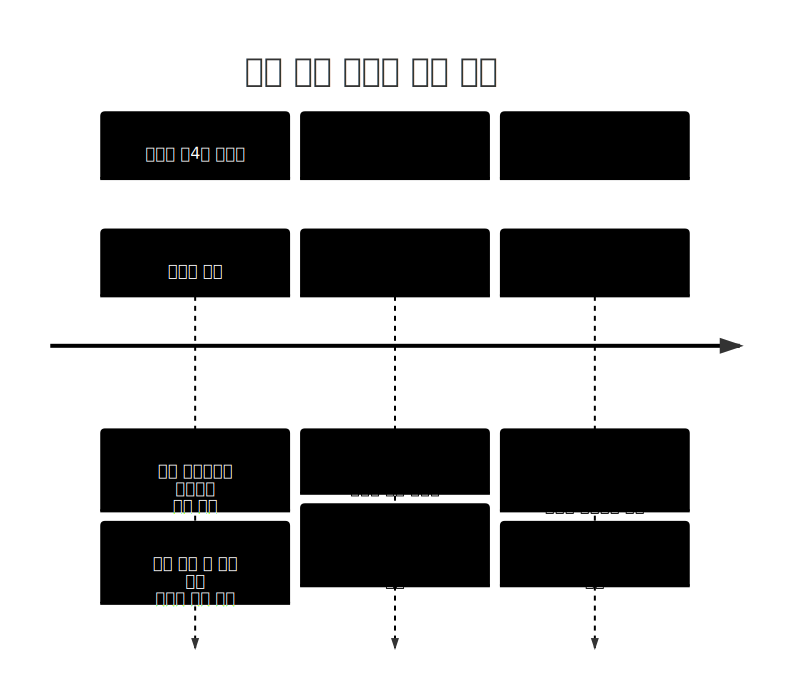

# Markdown Preview Studio

브라우저와 Windows 데스크톱 앱에서 쓰는 Markdown 편집기입니다. 왼쪽에서 Markdown 원문을 편집하면 오른쪽에서 실시간 preview를 보여줍니다. 이미지, SVG, LaTeX 수식, LaTeX 표, PDF 저장, 원문/preview 복사, preview 전체화면을 지원합니다.

## 실행

가장 간단한 실행은 정적 서버로 띄우는 방식입니다.

```powershell
python -m http.server 8080 --bind 127.0.0.1 --directory C:\Users\kkmin\.gemini\antigravity\scratch
```

브라우저에서 엽니다.

```text
http://127.0.0.1:8080/web-md/index.html
```

`serve_local.py`를 사용할 수도 있습니다. 이 서버는 `scratch` 폴더 아래의 문서와 이미지 경로를 안전하게 읽는 API를 제공합니다.

```powershell
python serve_local.py
```

Node 서버를 사용할 수도 있습니다. Electron 앱 빌드와 같은 `package.json`에서 관리됩니다.

```powershell
npm install
npm run serve:web
```

정적 파일(`index.html`, `script.js`, `style.css`, `latex.js`)만 고친 경우 서버를 다시 켤 필요는 없습니다. 브라우저만 새로고침하면 됩니다. 캐시가 남으면 `Ctrl + F5` 또는 `Ctrl + Shift + R`로 강력 새로고침하세요.

## 시작 문서

`index.html`에는 예시 Markdown 본문이 직접 들어 있지 않습니다. 페이지가 열리면 `script.js`의 `loadTestMd()`가 같은 폴더의 `test.md`를 불러와 에디터에 넣습니다.

초기 예시를 바꾸려면 `test.md`를 수정하세요. 빈 에디터로 시작하고 싶으면 `script.js`의 `init()` 안에서 `await loadTestMd();` 호출을 제거하거나 주석 처리하면 됩니다.

## 주요 파일

- `index.html`: 앱 UI와 라이브러리 로딩
- `script.js`: Markdown 변환, 파일 열기/저장, 수식 처리, 복사 버튼 동작
- `style.css`: 편집기와 preview 스타일
- `latex.js`: Upmath 기반 LaTeX 보조 렌더러
- `LatexTable.js`: LaTeX `tabular` 표 렌더링
- `test.md`: 앱 시작 시 자동으로 불러오는 예시 문서
- `serve_local.py`: 로컬 문서와 이미지 자산을 열기 위한 서버
- `server.js`: Node 기반 정적/문서 API 서버
- `package.json`: Electron 앱 실행과 Windows 빌드 설정
- `build/icon.svg`, `build/icon.ico`: 앱 아이콘 원본과 Windows 빌드용 아이콘
- `main.js`: Electron 메인 프로세스
- `preload.js`: Electron renderer에 안전하게 노출하는 desktop API

## LaTeX 수식

수식은 Upmath SVG 이미지로 렌더링합니다.

지원 문법:

```md
Inline: \( \alpha + \beta \)
Inline: $x^2 + y^2$
Block: \[ x^2 + y^2 = r^2 \]
Block: $$x^2 + y^2 = r^2$$
```

`$...$` inline 문법은 일반 Markdown 문서 호환을 위해 추가했습니다. 다만 화폐 단위와 충돌을 줄이기 위해 `$` 다음이 숫자인 경우는 수식으로 처리하지 않습니다.

예를 들어 아래 문장은 수식으로 변환하지 않습니다.

```md
가격은 $2, $3, $4로 $2~$4 입니다.
```

달러 기호를 문자 그대로 쓰고 싶으면 `\$`처럼 escape할 수 있습니다.

## 이미지와 SVG

Markdown 이미지 문법을 지원합니다.

```md


```

브라우저에서 파일만 직접 연 경우 상대 이미지 경로가 제한될 수 있습니다. 이미지가 안 보이면 먼저 Markdown 파일을 열고, `폴더 선택`으로 해당 문서의 이미지 폴더를 연결하세요. 로컬 서버 모드에서는 `/api/asset` 경로를 통해 문서 주변 이미지도 찾아줍니다.

## LaTeX 표

`tabular` 블록은 `LatexTable.js`가 HTML 표로 렌더링합니다.

```latex
\begin{tabular}{|c|c|}
\hline
A & B \\ \hline
1 & 2 \\ \hline
\end{tabular}
```

## 복사 버튼

에디터 상단의 `복사` 버튼은 왼쪽 textarea의 Markdown 원문을 복사합니다.

오른쪽 `Copy All Content` 버튼은 preview HTML과 plain text를 함께 복사하려고 시도합니다. 브라우저가 HTML clipboard API를 지원하지 않거나 권한이 막힌 경우 plain text 복사로 fallback합니다.

## 저장

`저장하기`를 누르면 저장 형식을 묻습니다.

- `md`: 원본 Markdown 저장
- `svg`: SVG 파일을 열었을 때 원본 SVG 저장
- `pdf`: 현재 preview를 인쇄 프레임으로 보내 PDF 저장

브라우저가 File System Access API를 지원하면 파일 저장 대화상자를 사용합니다. 지원하지 않는 경우 다운로드 방식으로 저장합니다.

## 캐시 버전

`index.html`은 `script.js?v=13`, `style.css?v=13`, `latex.js?v=13`처럼 버전 쿼리를 붙여 브라우저 캐시를 피합니다. JS/CSS를 고친 뒤 브라우저가 예전 동작을 보이면 버전 숫자를 올리고 강력 새로고침하세요.

화면 안내 문구 옆의 `Markdown Preview Studio v2.1.0` 표식은 현재 로드된 앱 버전을 확인하기 위한 표시입니다.

## Electron 앱

이 폴더는 웹 실행과 Electron 앱 빌드를 한곳에서 처리합니다. 앱 표시 이름은 `Markdown Preview Studio`이고, Windows 빌드에는 `build/icon.ico` 아이콘을 사용합니다.

개발 모드:

```powershell
npm install
npm start
```

패키징 확인:

```powershell
npm run pack
```

Windows 설치형/무설치형 빌드:

```powershell
npm run dist:win
```

빌드 산출물과 의존성 폴더(`node_modules`, `dist`, `release-*`)는 `.gitignore`로 제외합니다.

## 최근 수정 요약

- `\(...\)` inline 수식이 block 이미지처럼 배치되던 문제 수정
- Upmath 수식 이미지를 preview 렌더링 후 inline 스타일로 보정
- `$...$` inline 수식 문법 추가
- `$2`, `$2~$4` 같은 화폐 표현은 수식 처리에서 제외
- `latex.js`에 남아 있던 git 충돌 마커와 중복 본문 정리
- 에디터 `복사` 버튼을 Markdown 원문 복사로 수정
- preview `Copy All Content`에 HTML 복사 실패 시 plain text fallback 추가
- `md-viewer`의 Electron 앱 빌드 설정을 `web-md`로 통합

## 알려진 주의점

- `$...$` 수식과 일반 문장 속 달러 기호는 문법상 충돌할 수 있습니다. 현재는 숫자로 시작하는 `$2` 형태를 화폐로 보고 제외하는 휴리스틱을 사용합니다.
- 수식 렌더링은 `i.upmath.me` SVG에 의존하므로 네트워크가 막히면 수식 이미지가 보이지 않을 수 있습니다.
- 단순 Python 정적 서버는 live reload 기능이 없습니다. 파일 변경 후 브라우저를 새로고침해야 합니다.
